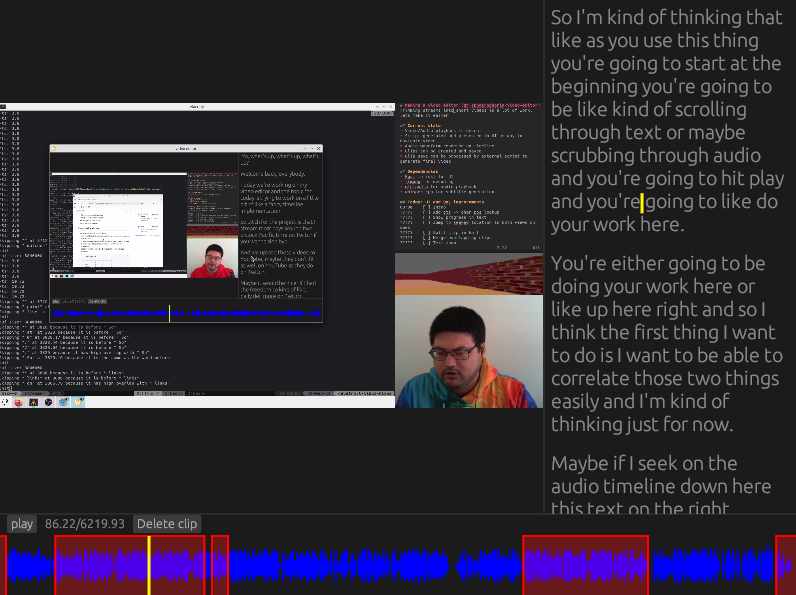

# Video editor for specifically me

Developed live on [twitch](https://twitch.tv/sphaerophoria) and [youtube](https://youtube.com/playlist?list=PL980gcR1LE3IrSp9xkLHvogSs1QaaDIwu&si=EDrkx6xe_U1GqJvd)

## Elevator pitch
* Streams produce long videos
* Maybe short videos are better
* Cutting stuff down is hard
* Can we make it easier?

## Current state
* Functional enough
* Seek by auto-generated subtitles
* Select sections on timeline with ctrl-click + drag
* Sections will automatically play back to back
* Save with ctrl+s and export to final video with run\_ffmpeg\_on\_save.py

## Screenie

## R.I.P.
This is far enough along that I was able to use it to experiment with my use
case, cutting down twitch VODs into something shorter. I found that I didn't
like any of the cuts I was making, so have lost interest on progressing this
farther. No further development is expected, but feel free to continue on if
you think it's valuable
